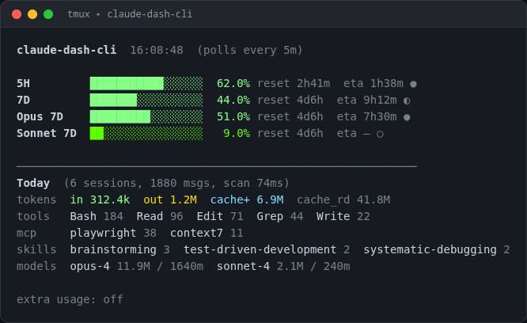
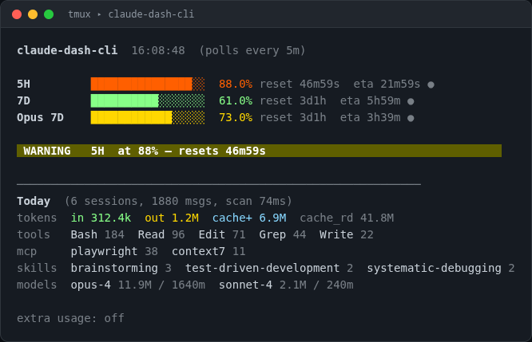
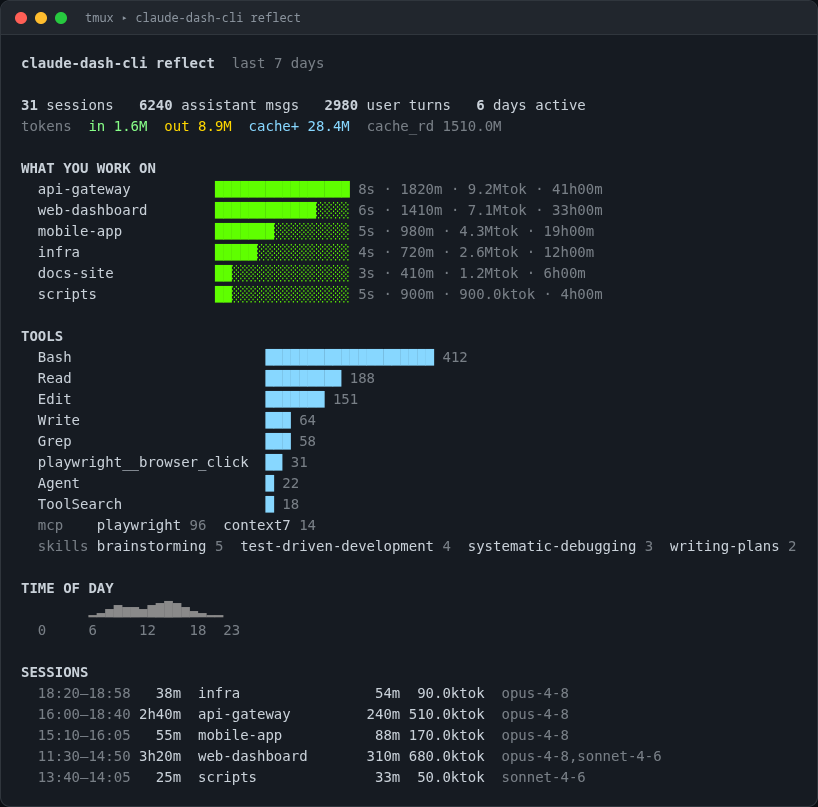

# claude-dash-cli

> Terminal dashboard for your Claude usage limits — built to live in a tmux pane.


A single always-on pane that answers two questions at a glance — **how much usage runway is left**, and **where today's budget went** — without leaving the terminal.



Fork of [claude-dash](https://github.com/adelhelalpro-ai/claude-dash) — same prediction engine (EWMA + multi-horizon consensus), but no Electron, no build step, and **zero dependencies**. It shares Claude Code's login, so there's no separate auth.

> The screenshots are real `render()` output with representative data — same code path you'll see live, just not anyone's actual transcripts.

## Features

- **Live limit tracking** — utilization per rolling window (5H / 7D / per-model), each with a reset countdown.
- **ETA to 100%** — an EWMA-predicted time-to-limit so you can pace a long session or break before a hard stop. A confidence glyph (`●` `◐` `○` `·`) tells you how much to trust it.
- **Today's activity panel** — tokens, top tools, MCP servers, skills, and models, scanned straight from your `~/.claude` transcripts.
- **`reflect` retrospective** — a one-shot report (`claude-dash-cli reflect`) that wraps up what you did: sessions, projects, tool usage, and a time-of-day histogram, à la Claude Code's `/insights`. JSON output for piping.
- **Warning / Critical banner** — a full-width strip appears once any limit crosses 80% / 95%.
- **Color-ramped bars** — green → yellow → red by utilization.
- **Zero dependencies** — plain Node.js, ~900 lines. Easy to read, easy to fork.
- **Shares Claude Code's login** — reads `~/.claude/.credentials.json`; no separate sign-in.

## Why

You're coding in the terminal and you don't want to discover you've hit a usage wall mid-task. claude-dash-cli keeps the answer in your peripheral vision:

- **How much runway is left?** — utilization, the reset countdown, and the predicted ETA to 100%.
- **Where did today's budget go?** — tokens, top tools, MCP servers, skills, and models, so you can see what's actually burning context.

It stays out of the way until a limit gets close — then it shouts.

## What it looks like

The top block is your **plan limits** (live from the usage API); the bottom block is **today's local activity** scanned from your transcripts. When a limit crosses 80% the `WARNING` strip appears (red `CRITICAL` at 95%):



<details>
<summary>Plain-text capture (for screen readers / copy-paste)</summary>

```text
claude-dash-cli  11:17:45  (polls every 5m)

5H         ████░░░░░░░░░░░░░░░░░░░░░  15.0% reset 3h12m  eta 3h33m ○
7D         █░░░░░░░░░░░░░░░░░░░░░░░░   2.0% reset 2d2h  eta — ·
Sonnet 7D  ░░░░░░░░░░░░░░░░░░░░░░░░░   0.0% reset now  eta — ·

────────────────────────────────────────────────────────────
Today  (4 sessions, 314 msgs, scan 57ms)
tokens  in 231.7k  out 433.6k  cache+ 1.0M  cache_rd 20.7M
tools   Bash 67  Read 17  Agent 10  Edit 9  ToolSearch 7
mcp     playwright 13
skills  brainstorming 1  skill-creator 1
models  opus-4 1.7M / 313m  <synthetic> 0 / 1m

extra usage: off
```

</details>

## Retrospective: `reflect`

The live dashboard answers *"how close am I to a limit?"*. `reflect` answers *"what did I actually do?"* — a one-shot, pipeable report scanned from your local transcripts. It's the terminal, zero-dependency cousin of Claude Code's `/insights` (the quantitative half — no AI-written prose).

```bash
claude-dash-cli reflect                  # today
claude-dash-cli reflect --since 7d        # last 7 days
claude-dash-cli reflect --since 30d
claude-dash-cli reflect --since all
claude-dash-cli reflect sessions          # just one section
claude-dash-cli reflect --format json     # raw data for scripting
```



Sections: **overview** (sessions, messages, tokens, days active + a time-of-day histogram), **projects** (what you worked on, grouped by directory), **tools** (tool / MCP / skill usage), and **sessions** (a per-session timeline). Pass a section name to show only that one. Window defaults to **today**; override with `--since today|7d|30d|all|YYYY-MM-DD`.

## Requirements

- **Node.js ≥ 18**
- **[Claude Code](https://docs.anthropic.com/en/docs/claude-code)** installed and logged in (`~/.claude/.credentials.json` must exist). The CLI shares tokens with Claude Code — no separate login.

## Install

```bash
git clone https://github.com/mmaximov97/claude-dash-cli.git
cd claude-dash-cli
```

To run `claude-dash-cli` from **any directory**, link it globally:

```bash
chmod +x bin/claude-dash-cli
npm link
```

`npm link` symlinks the `bin` entry into your global npm path (already on `PATH`), so edits to `src/` are picked up live — no reinstall needed. Then run it anywhere:

```bash
claude-dash-cli
```

Verify the link:

```bash
which claude-dash-cli   # prints the symlink path
```

> **nvm note:** the symlink lives under the active Node version. If you `nvm use` a different version, re-run `npm link` there. To remove it later: `npm unlink -g claude-dash-cli`.

Or skip linking and run directly:

```bash
node src/index.js
```

## Use in tmux

```bash
# split a narrow right pane and run the dashboard there
tmux split-window -h -p 30 'claude-dash-cli'
```

The dashboard:

- Polls `https://api.anthropic.com/api/oauth/usage` every **5 min** (the endpoint rate-limits to ~5 req/token — don't reduce this).
- Redraws every **1 s** so the "resets in" and "ETA" countdowns stay live between fetches.
- Rotates the OAuth token on `429` (per-token rate limit → a fresh token resets it).
- Persists prediction history to `~/.config/claude-dash-cli/history.json` (24 h rolling).

## What's on screen

**Limit rows** (whichever your plan exposes):

| Row | Window |
| --- | --- |
| `5H` | 5-hour rolling window |
| `7D` | 7-day rolling window |
| `Opus 7D` / `Sonnet 7D` / `Cowork 7D` | model-specific 7-day windows |

Each row shows utilization, the rolling-window reset countdown, and the EWMA-predicted ETA to 100%. Confidence glyph: `●` high · `◐` medium · `○` low · `·` not enough data yet.

**Today panel** (from your `~/.claude` transcripts): session/message counts, token split (in / out / cache-creation / cache-read), top tools, MCP servers, skills, and per-model token & message totals.

## How it works

```
bin/claude-dash-cli → src/index.js          # subcommand dispatch + poll/redraw loop
                       ├─ src/auth.js        # reads ~/.claude credentials, rotates tokens on 429
                       ├─ src/usage.js       # fetches the usage API, EWMA prediction engine
                       ├─ src/stats.js       # scans local transcripts for today's activity
                       ├─ src/render.js      # turns dashboard state into the ANSI frame
                       └─ src/reflect.js     # the `reflect` retrospective (scan → aggregate → render)
```

- `index.js` runs two timers: a 5-minute usage poll and a 1-second redraw, plus a 60-second transcript rescan.
- `usage.js` keeps a 24 h rolling history and runs a multi-horizon EWMA consensus to estimate time-to-limit.
- `render.js` is intentionally hackable (see below).

## Customizing the display

Three functions in `src/render.js` are marked `TODO (you):` — they ship with working stub implementations, but they're the seams meant for you to reshape:

1. **`renderRow(key, limit, width)`** — the per-limit line format (compact vs wide, bar width, color ramp, glyphs).
2. **`renderBanner(highest, width)`** — what shows when a limit crosses 80% / 95% (full-width strip? inline badge? blinking?).
3. **`renderStats(stats, width)`** — the today panel (horizontal vs list, top-N tools, how to surface cache reads, sort order).

The whole point of the fork is that these are yours to shape.

## Contributing

Issues and PRs welcome. The codebase is small and dependency-free by design — please keep it that way (no runtime `dependencies` in `package.json`). When changing the rendering, a screenshot of before/after helps a lot.

Tests use the built-in Node test runner (no deps):

```bash
npm test            # runs node --test over tests/
```

## Credits

Forked from [**claude-dash**](https://github.com/adelhelalpro-ai/claude-dash) by Adel Helal — the prediction engine and the idea are theirs. This fork strips Electron down to a terminal pane.

## License

[MIT](LICENSE) (inherited from upstream).
